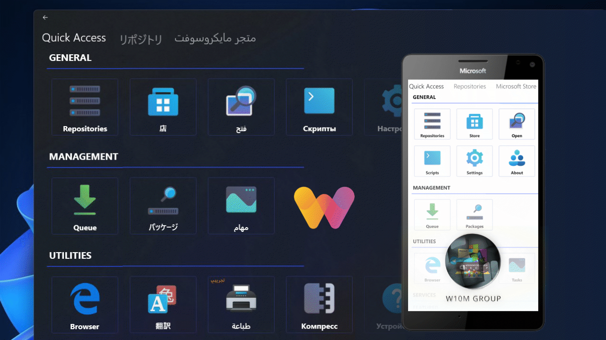

   
  <b>Windows Universal Tool</b> 
    
   

## Overview

A powerful universal tool, complex tasks work in one place.

<a href="https://github.com/basharast/wut/wiki/Content">Content Policy</a>

<a href="https://github.com/basharast/wut/wiki/Privacy">Privacy Policy</a>

## Thanks

Speical thanks for everyone tried to support my work:
- David Hartanto
- Aleksandar Milijevic
- Julien BANZET

## Credits

[Read here about the full credits](https://github.com/basharast/wut/wiki/Credits)

## Support

Use it as is, it's a community project, fixing issues will not be covered as expected due to my limited time

and the app has reached it limited capacity no further features are expected.

## Features

- Universal (UWP).
- Privacy (0% data collection).
- Multi languages.
- Scripts Engine (Commander).
- Batch Download.
- MEGA.nz Client.
- Unsplash Client.
- Print Service.
- Images Effects.
- Built-in Browser.
- Packages Management.
- Download Client.
- Media Preview (PDF, Videos..etc).
- Advanced Settings.
- And more..

## Open Source?

I don't benefit from WUT at all, it's completely free and made to help others for real

there are no plans for now to make the project opensource due to some considerations

this could change in future, but for now consider WUT as closed source project

if you have any concerns (which is perfectly fine and normal) please contact me.

However, parts of WUT already published for help and educational usage

## Repo + Authentication

This feature made to help content creators to protect their own files and share it with limited users

Check out <a href="https://github.com/basharast/wut/wiki/Mega-Repo">MEGA Repo Wiki</a>

## Supported Platforms:

Windows Phone (W10M)

Windows 10 & Windows 11 (x64 - x86 - arm)

ARM based devices are strongly supported as the app made on the lowest possible target (14393)

## WUT Mini

- Compatible with builds 10240+
- Lite Cache
- RAM Friendly
- Commander (WUT Scripts)
- Astoria Tools
- Much more..

### Known issues (Mini)
Note that issues below may occur on certain builds only,
- **Issue 1:** If you tried to open file WUT Mini may crash
- **Solution:** Navigate to the queue once before opening any file, then all will be ok

## Guides

Many thanks to [Lasitha Samarasighe](https://www.t.me/Lasitha_S) for preparing these guides

### Installation

  
<strong>Install Via ImMobile (Click Here)</strong>

   

https://github.com/user-attachments/assets/d4e24972-cc46-4195-b847-72cf5d72d20c

### Features 

## Download:

<a href="https://github.com/basharast/wut/releases/latest">Click Here</a>

## About Commander (Scripts Engine):

Check out <a href="https://github.com/basharast/wut/wiki">GitHub Wiki</a>

Commander built to help anyone to create unlimited scripts for different purposes using GUI elements

The script structure is very simple.

You can mix between commander codes and batch script (Telnet required) to get more advanced usage

I tried to add commands as much as I can to make it more usable.

Commander can be used like Automate.

Checkout the documentation with the installation file for more details and demos.

## Thanks:

Special thanks for all the friends in <a href="https://t.me/Windows10Phone">W10M Community</a> and for their suggestions and support.

Unsplash feature was not possible without [Hangon ](https://github.com/rootasjey/Hangon) by Jeremie Corpinot 

